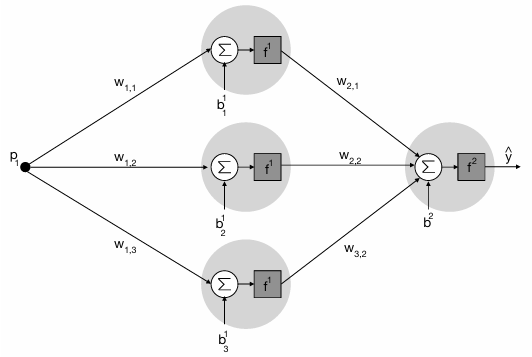
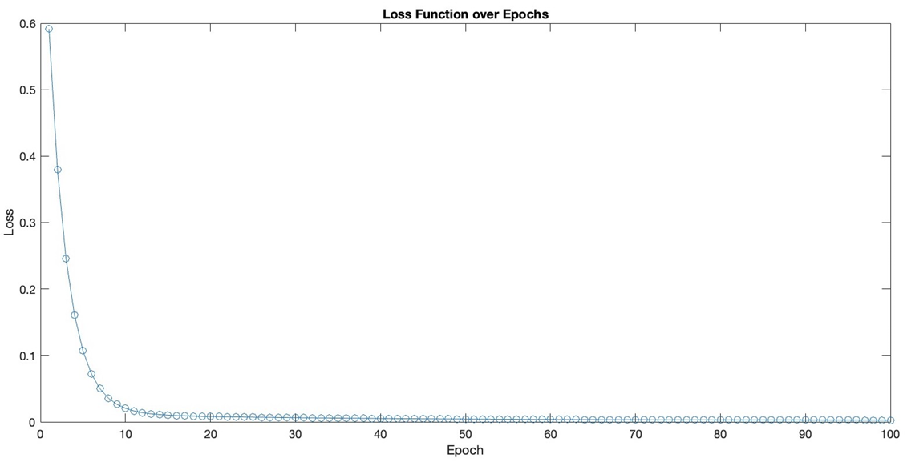
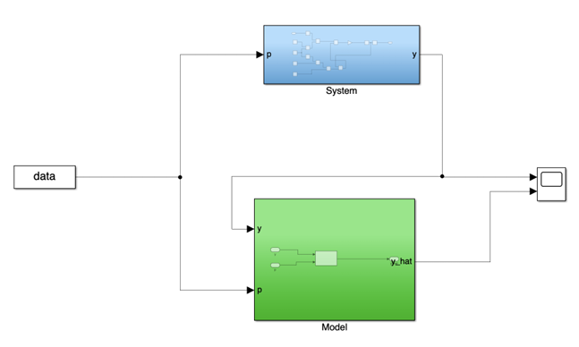
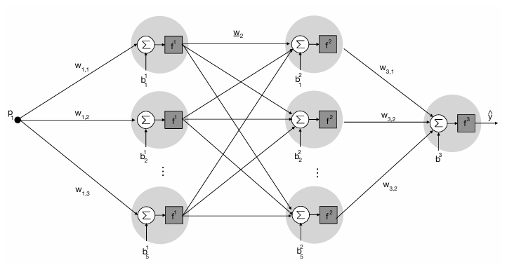

# Multi-Layer Perceptron (MLP) & Elman Neural Networks for System Identification

This project implements **Multi-Layer Perceptron (MLP)** and **Elman Neural Networks** in MATLAB for basic system identification tasks.  
All models are built in MATLAB showcasing manual implementation of **forward propagation**, **backpropagation**, and **weight updates**.

---
## MLP 1-3-1

- **1 input neuron**
- **1 hidden layer** with configurable size (here: 3)
- **1 output neuron**
- **Tanh activation function** for the hidden layer
- **Linear activation** for the output layer

<p align="center">
  
</p>

---

### How It Works

1. **Initialization**  
   Random weights and biases are assigned for each layer.

2. **Forward Pass**  
   - Hidden layer activations computed with **tanh**.  
   - Output computed with a linear transformation.

3. **Loss Function**  
   - Mean Squared Error (MSE) between predictions and target outputs.

4. **Backpropagation**  
   - Gradients for all weights and biases are computed manually.  
   - Parameters are updated using **gradient descent**.

5. **Training**  
   - Runs for a defined number of epochs.  
   - Prints loss at regular intervals.

### Parameters in `Model.m`

| Parameter        | Description                                  |
|------------------|----------------------------------------------|
| `inputSize`      | Number of input neurons                      |
| `hiddenSize`     | Number of neurons in the hidden layer         |
| `outputSize`     | Number of output neurons                      |
| `learningRate`   | Step size for gradient descent                |
| `epochs`         | Number of training iterations                 |

### Loss-Fuction

<p align="center">
  
</p>

### Simulink Model — `KNN.slx`

This repository contains a basic Simulink model **`KNN.slx`**, which implements a **Multi-Layer Perceptron (MLP)** for system identification.

<p align="center">
  
</p>

- **Data Input (`data`)**: Supplies the input signals for both the real system and the MLP model.
- **System Block**: Represents the real system to be identified.  
  - Input: `p` (control signal)  
  - Output: `y` (system response)
- **Model Block (MLP)**: Neural network implementation that predicts the system output.  
  - Inputs: `y` (system output) and `p` (control signal)  
  - Output: `y_hat` (predicted system response)
- **Comparison**: The predicted output `y_hat` is compared against the true output `y` to evaluate the identification accuracy.

This configuration allows the MLP to be trained and validated directly within Simulink, enabling seamless integration of neural network modeling with simulation workflows.

---
## MLP 1-5-5-1 

<p align="center">
  
</p>

### Structure
- **Input layer**: 1 neuron (`p_i`)
- **Hidden Layer 1**: 5 neurons, activation function `tanh` (`f^1`)
- **Hidden Layer 2**: 5 neurons, activation function `tanh` (`f^2`)
- **Output Layer**: 1 neuron, linear activation (`f^3`) producing prediction `ŷ`

### Notation
- **Weights**:
  - `W1`: connects input layer → hidden layer 1 (`1 × 5`)
  - `W2`: connects hidden layer 1 → hidden layer 2 (`5 × 5`)
  - `W3`: connects hidden layer 2 → output layer (`5 × 1`)
- **Biases**:
  - `b1`: bias for hidden layer 1 (`1 × 5`)
  - `b2`: bias for hidden layer 2 (`1 × 5`)
  - `b3`: bias for output layer (`1 × 1`)

---

### MATLAB Implementation

### Inputs
- `set`: Training dataset (column 2 contains system outputs, column 1 is index/time)
- `set_val`: Validation dataset in same format as `set`

### Outputs
- `y_hat`: Predicted output for the validation dataset

### Main Steps
1. **Data Preparation**  
   - `Y` (target output) and `X` (input) are extracted from `set`.
   - Validation data (`Y_val`, `X_val`) is extracted from `set_val`.

2. **Network Initialization**  
   - Random initialization of `W1`, `b1`, `W2`, `b2`, `W3`, `b3`.
   - Architecture fixed to **1-5-5-1**.
   - Learning rate: `0.08`.

3. **Training Loop** (1000 epochs)
   - **Forward Pass**:
     - Hidden Layer 1: `A1 = tanh(X*W1 + b1)`
     - Hidden Layer 2: `A2 = tanh(A1*W2 + b2)`
     - Output Layer: `Z3 = A2*W3 + b3`
   - **Loss**: Mean Squared Error (MSE)
   - **Backpropagation**:
     - Compute gradients for `W3`, `b3`, `W2`, `b2`, `W1`, `b1`
     - Update parameters using gradient descent
   - Loss is stored every 10 epochs for plotting

4. **Plotting**
   - **Training comparison**: System output (`Y`) vs Model output (`Z3`)
   - **Loss curve**: Evolution of MSE over epochs
   - **Validation comparison**: `Y_val` vs model predictions

5. **Validation**
   - Forward pass using trained weights on `set_val`
   - Plot and compute validation loss

---

### 3. Activation Functions
- **tanh(x)**:  
  \[
  \tanh(x) = \frac{e^x - e^{-x}}{e^x + e^{-x}}
  \]
- **Derivative**:  
  \[
  \tanh'(x) = 1 - \tanh(x)^2
  \]

---

### 4. Example Usage
```matlab
% Load your training and validation datasets
load('training_data.mat');    % variable: set
load('validation_data.mat');  % variable: set_val

% Run the MLP
y_hat = KNN_verbessert(set, set_val);
```

---
## Elman Recurrent Neural Network (1-5-1)

The **Elman Network** is a type of **Simple Recurrent Network (SRN)** that introduces **context neurons** to retain information from the previous time step, enabling it to handle temporal dependencies.

### Structure
- **Input layer**: 1 neuron
- **Hidden layer**: 5 neurons with **tanh activation**
- **Context layer**: Stores previous hidden layer activations and feeds them back into the network at the next time step
- **Output layer**: 1 neuron (linear activation)

### Notation
- **Weights**:
  - `W1`: weights from **input + context** to hidden layer (`(1 + hiddenSize) × hiddenSize`)
  - `W2`: weights from hidden layer to output layer (`hiddenSize × outputSize`)
- **Biases**:
  - `b1`: bias for hidden layer (`1 × hiddenSize`)
  - `b2`: bias for output layer (`1 × outputSize`)


### 2. MATLAB Implementation

### Inputs
- `set`: Training dataset (column 2: output values, column 1: index/time)
- `set_val`: Validation dataset (same format)

### Outputs
- `y_hat`: Predicted output for the validation dataset

---

### 3. Workflow

### 3.1 Data Preparation
- **Training set**:
  - `Y`: true system outputs (excluding the first row)
  - `X`: shifted system outputs (previous time step values)
- **Validation set**: similarly split into `Y_val` and `X_val`

### 3.2 Initialization
- Random weights (`W1`, `W2`) and biases (`b1`, `b2`)
- **Context neurons** initialized to zero
- Learning rate: `0.1`
- Epochs: `1000`
- Loss storage every 10 epochs

### 3.3 Training Loop
1. **Forward Pass**:
   - Concatenate current inputs with context neurons
   - Compute hidden layer activations using `tanh`
   - Compute output layer activations (linear)
2. **Loss Calculation**:
   - Mean Squared Error (MSE)
3. **Backpropagation**:
   - Compute gradients for `W2`, `b2`, `W1`, `b1`
   - Apply gradient descent updates
4. **Update Context**:
   - Store hidden layer activations for next step
5. **Loss Tracking**:
   - Store loss every 10 epochs for visualization

### 3.4 Validation
- Forward pass using trained weights on `set_val`
- Compute MSE and plot predicted vs true outputs

---

### 4. Activation Functions
- **tanh(x)**:
  \[
  \tanh(x) = \frac{e^x - e^{-x}}{e^x + e^{-x}}
  \]
- **Derivative**:
  \[
  \tanh'(x) = 1 - \tanh(x)^2
  \]

---

### 5. Example Usage
```matlab
% Load your training and validation datasets
load('training_data.mat');    % variable: set
load('validation_data.mat');  % variable: set_val

% Run the Elman RNN
y_hat = Elman_Network(set, set_val);
```

## Usage

MATLAB R2024b

1. Clone this repository:
   ```bash
   git clone https://github.com/<USER>/MLP-Elman-Neural-Network-System-Identification.git
   ```

